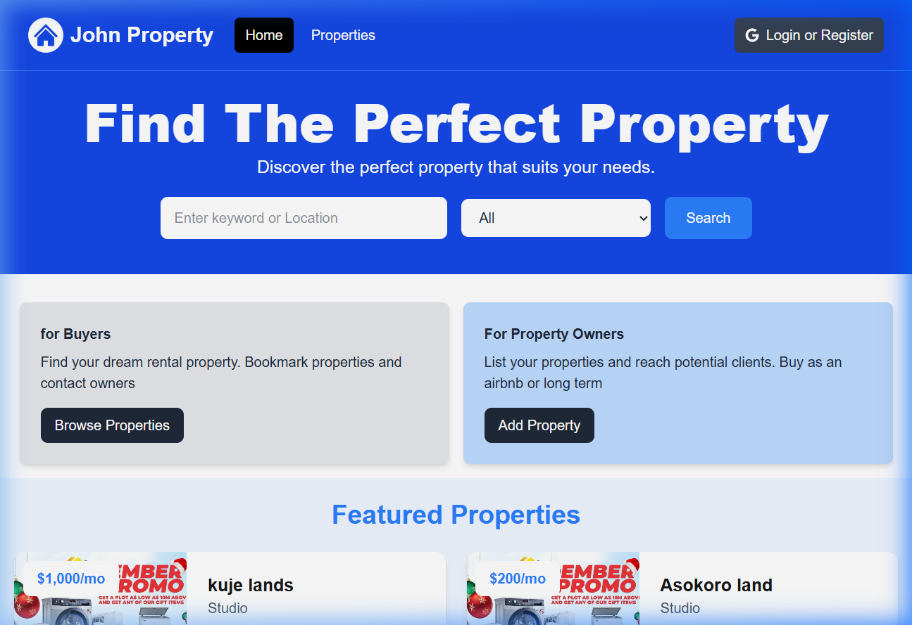
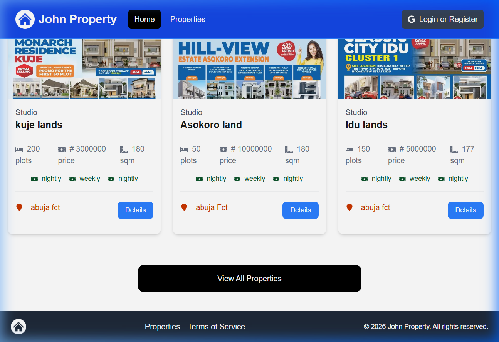
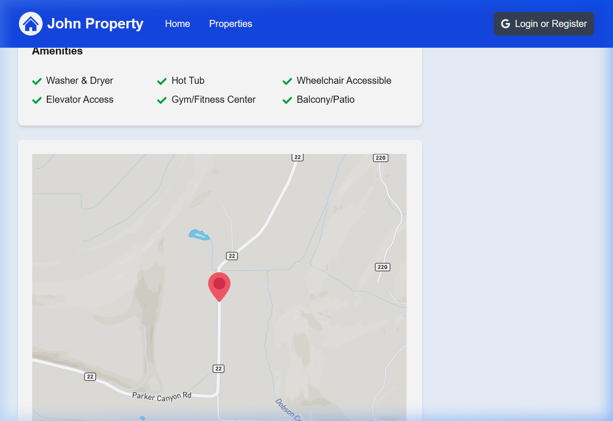

# Full-Stack Real Estate & Property Services Platform
A high-performance, responsive real estate web application built using the Next.js App Router and MongoDB. This platform is optimized for speed, mobile responsiveness, and dynamic content management, making it an ideal framework for property management companies and real estate agencies.

## 🚀 Key Features

* **Dynamic Server-Side Rendering (SSR):** Fast initial page loads using Next App Router for  optimal SEO.
* **Robust Backend Architecture:** Scalable data layer built with Nextjs api and MongoDB object modeling.
* **Responsive UI/UX:** Fully optimized for mobile, tablet, and desktop viewports using Tailwind CSS.
* **Flexible State Management:** Clean data handling using React Context API and custom utility hooks.
* **Type Safety:** Built with TypeScript to ensure maintainable, error-free production code.
* **authentification:** Next-Auth (OAuth)

## 🛠️ Tech Stack

* **Frontend:** React, Next.js (App Router), Tailwind CSS
* **Backend & Database:** Nextjs API Routes, MongoDB, Mongoose
* **State & Configuration:** React Context, TypeScript

## 📦 Project Structure

* `/app` - Next.js core application routes and pages
* `/components` - Reusable UI elements (Navbar, Cards, Modals)
* `/models` - MongoDB data schemas for properties and users
* `/config` - Database connections and environment setups
* `/context` - Global state management providers
* `/utils` - Helper functions and API handlers

## 📸 Screenshots

### 🏠 Homepage — Hero & Search

### 🏘️ Recent Properties Listing

### 📍 Property Detail — Amenities & Map

